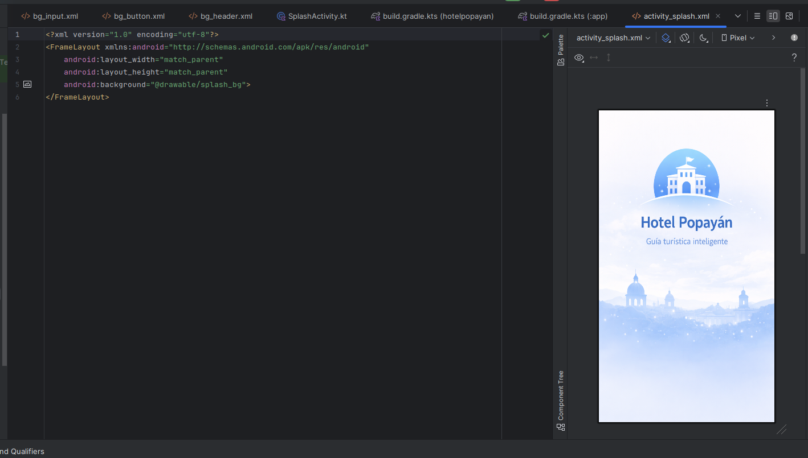
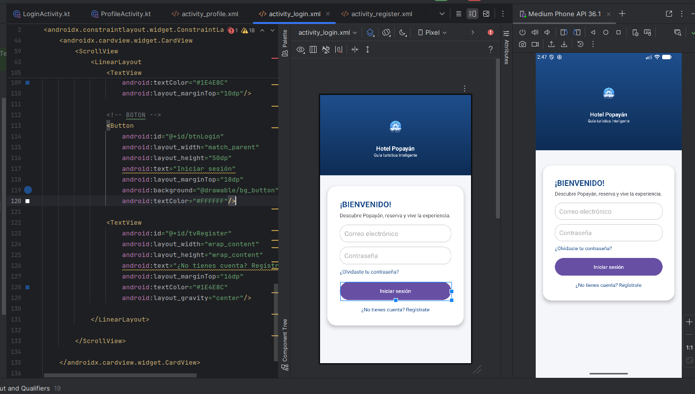
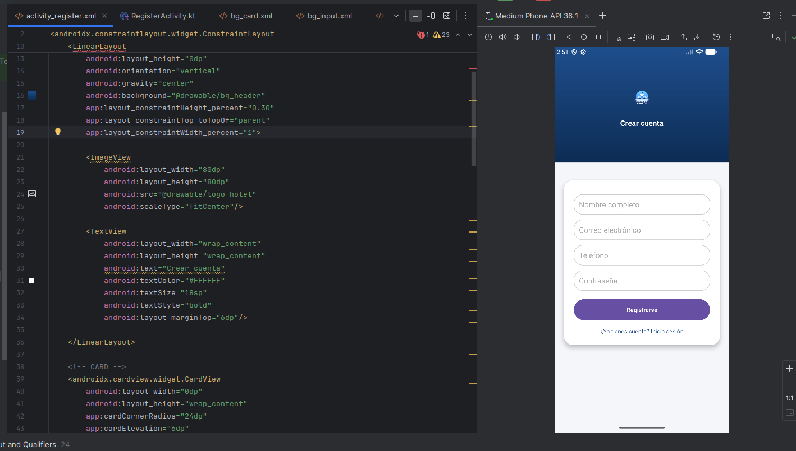
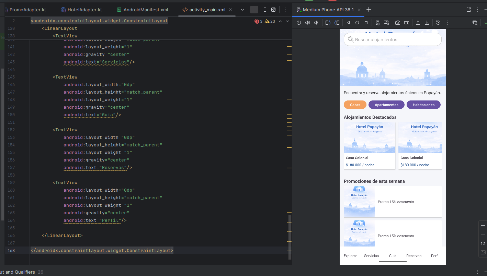

# 🏨 Hotel Popayán App

Aplicación móvil Android desarrollada en **Kotlin** que permite a los usuarios explorar alojamientos en Popayán, registrarse, iniciar sesión y gestionar su perfil dentro de una experiencia moderna.
---
Equipo: 
Juan camilo uni anacona
Juan Pablo Cardona
Juan Felipe Garcia 

---

## 📱 Descripción

Este proyecto simula una plataforma de reservas de alojamientos, enfocada en una experiencia intuitiva y visualmente atractiva, aplicando buenas prácticas de desarrollo móvil en Android.

Actualmente se encuentra en fase de **MVP (Producto Mínimo Viable)** con enfoque en UI/UX y navegación entre pantallas.

---

### 🚀 0. Splash Screen
- Pantalla de carga inicial
- Muestra logo de la aplicación
- Transición automática al login 

### 🔐 1. Login
- Inicio de sesión de usuario
- Acceso a registro
- Navegación al Home

---

### 📝 2. Registro
- Creación de cuenta
- Campos: nombre, email, teléfono, contraseña
- Navegación hacia login

---

### 🏠 3. Home (Explorar)
- Buscador de alojamientos
- Filtros por categoría:
  - Casas
  - Apartamentos
  - Habitaciones
- Sección de:
  - Alojamientos destacados (RecyclerView horizontal)
  - Promociones (RecyclerView vertical)
- Bottom Navigation funcional

---

### 👤 4. Perfil
- Información del usuario
- Menú de opciones:
  - Información personal
  - Pagos y cobros
  - Mis reservas
  - Métodos de pago
  - Notificaciones
  - Centro de ayuda
- Botón de cerrar sesión
- Items interactivos (click + ripple effect)

---

## 🧱 Estructura del proyecto
